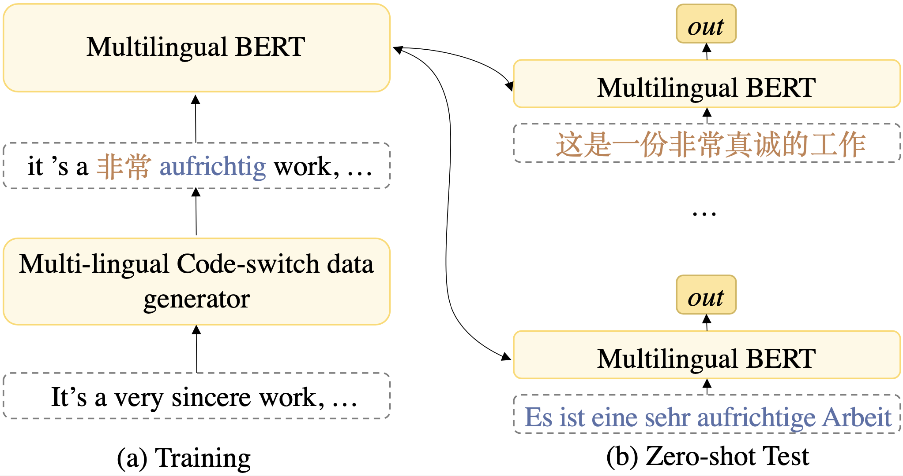

# CoSDA-ML: Multi-Lingual Code-Switching Data Augmentation for Zero-Shot Cross-Lingual NLP

[](https://opensource.org/licenses/MIT)

This repository is for the IJCAI-2020 paper: [CoSDA-ML: Multi-Lingual Code-Switching Data Augmentation for Zero-Shot Cross-Lingual NLP](https://arxiv.org/pdf/2006.06402)

If you use any source codes or ideas included in this repository for your work, please cite the following paper.
<pre>
@misc{qin2020cosdaml,
    title={CoSDA-ML: Multi-Lingual Code-Switching Data Augmentation for Zero-Shot Cross-Lingual NLP},
    author={Libo Qin and Minheng Ni and Yue Zhang and Wanxiang Che},
    year={2020},
    eprint={2006.06402},
    archivePrefix={arXiv},
    primaryClass={cs.CL}
}
</pre>

If you have any questions, feel free to email [me](Mailto:mhni@ir.hit.edu.cn).

## Abstract

Multi-lingual contextualized embeddings, such as multilingual-BERT (mBERT), have shown success in a variety of zero-shot cross-lingual tasks. However, these models are limited by having inconsistent contextualized representations of subwords across different languages. Existing work addresses this issue by bilingual projection and fine-tuning technique. We propose a data augmentation framework to generate multi-lingual code-switching data to fine-tune mBERT, which encourages the model to align representations from source and multiple target languages once by mixing their context information. Compared with the existing work, our method does not rely on bilingual sentences for training and requires only one training process for multiple target languages. Experimental results on five tasks with 19 languages show that our method leads to significantly improved performances for all the tasks compared with mBERT. In addition, comprehensive analysis empirically shows the feasibility of our method.

## Illustration of Framework



## Preparation

### Environment

> + python==3.7.4
> + torch==1.1.0
> + numpy==1.17.2
> + tqdm==4.36.1
> + transformer==2.3.0
> + pytorch_transformers==1.2.0

Please note that because we finished the BERT and XLM experiments at different time, the version of transformers used is different.

### Dataset

All of the dataset files are in ```./dataset/```.

For more detail, please see Section 3.3 in the paper.

### Dictionary

Dictionary files we used are [MUSE Dictionary](https://github.com/facebookresearch/MUSE). However, for some language that cannot be found in MUSE, we extract their dictionary files from Panlex.

All the dictionary files can be found in ```./dataset/Panlex/```.

### Pre-trained Model

We use [multilingual-BERT](https://github.com/google-research/bert/blob/master/multilingual.md) and [XLM](https://github.com/facebookresearch/XLM) to finish the most of experiments. 

Please note that our framework also worked without any pre-trained model.  You can use BiLSTM as the encoder of the model instead of BERT or XLM. See Section 4.4 in the paper for more details.

### Saved Model

We also provide the model saved file to help you reproduce the results. Please download from the following links. Note that if you want to reproduce of BERT-based task identically, you also need to use the BERT version that we provided. 

(Please wait for uploading.)

## Framework Usage

For most tasks, it is really simple to run.

```
python start.py --cfg Task_Model.cfg
```

To run a specific task, please replace the "Task" to any task you want to run in {"DST", "MLDoc", "SC2", "SC4", "XTDS"} and "Model" in {"bert", "xlm"}.

You can find all of the original hyper-parameters in the cfg file.
All of the cfg files are in ```./configure/```.

### Dialogue State Tracking

For BERT-based model, please run:
```
python start.py --cfg DST_bert.cfg
```
For XLM-based model, please run:
```
python start.py --cfg DST_xlm.cfg
```

### Spoken Language Understanding

For BERT-based model, please run:
```
python start.py --cfg XTDS_bert.cfg
```
For XLM-based model, please run:
```
python start.py --cfg XTDS_xlm.cfg
```

Please note that we use the script ```./tool/conlleval.pl``` to evaluate the result. This script is wide-used in SLU task.

### Sentiment Classification

For BERT-based model and binary classification, please run:
```
python start.py --cfg SC2_bert.cfg
```
For XLM-based model, please run:
```
python start.py --cfg SC2_xlm.cfg
```

For BERT-based model and multi-classification, please run:
```
python start.py --cfg SC4_bert.cfg
```
For XLM-based model, please run:
```
python start.py --cfg SC4_xlm.cfg
```

Please note that the model definition file is the same with document classification.

### Document Classification

For BERT-based model, please run:
```
python start.py --cfg MLDoc_bert.cfg
```
For XLM-based model, please run:
```
python start.py --cfg MLDoc_xlm.cfg
```

### Custom Task

You can custom a task by providing a cfg file. The usage of major parameters is described in the list.

> + model.name The model defination file.
> + model.resume The model saved the file. Please delete this parameter if you do not want to load from the saved file.
> + model.test Whether just evaluate directly.
> + dataset.src Source language dataset.
> + dataset.tgt Target language dataset.
> + dataset.tool Dataset tool file.
> + dataset.dict Dictionary files.
> + lr.default Learning rate of the model except BERT.
> + lr.BERT Learning rate of BERT.
> + multi_bert.location BERT model file.
> + train.ratio Sentence selection ratio.
> + train.cross Token selection ratio.

You can add or modify the model definition file in ```./model/```. The tools for loading dataset and evaluation are in ```./util/dataset/```.

## Additional Information

### XNLI Task

For XNLI task, we do not use this code to fine-tune. Because both Facebook and Google provide the original code for XNLI, we simply modify their code to apply our framework.

For BERT-based model, we modify the data loading script and for XLM-based model, we modify the input preparation script.

Due to the limitation of GPU, the batch size we set is different from the original code.

### Reproduction

For data argumentation will be different on different devices, if you are not satisfied with the result you trained, we really recommend you to do a hyper-parameter search on "Sentence Selection Ratio" and "Token Selection Ratio" in the range {0.1, 0.2, 0.3, 0.4, 0.5, 0.6, 0.7, 0.8, 0.9}.